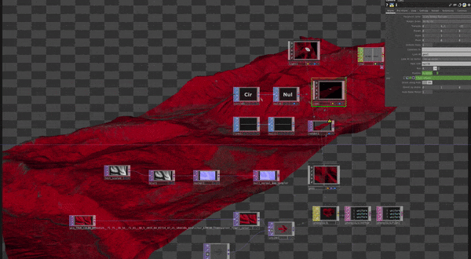

# Download satellite imagery & SRTM and use this in Touchdesigner
## Upload the Google Colab notebook on Google to get started. 

 

In the Google Colab notebook you can set a bounding box.  
The Colab notebook downloads satellite imagery with that date and settings in your Sentinel settings.
  
The Touchdesigner file is able to read the elevation file as a height map, and the satellite imagery as a texture.